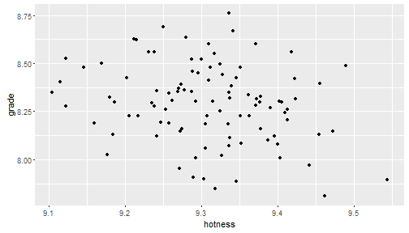

---

title       : Shiny WordCloud Pitch
subtitle    : Coursera - Developing Data Products
author      : Gene Kaufman
job         : Data Newbie
framework   : io2012        # {io2012, html5slides, revealjs, dzslides, ...}
highlighter : highlight.js  # {highlight.js, prettify, highlight}
hitheme     : tomorrow      # 
widgets     : [bootstrap]            # {mathjax, quiz, bootstrap}
mode        : selfcontained # {standalone, draft}
knit        : slidify::knit2slides

---
<style>
.title-slide {
  background-color: lightblue
}

.title-slide hgroup > h1{
 font-family: 'Oswald', 'Helvetica', sanserif; 
}

.title-slide hgroup > h1, 
.title-slide hgroup > h2 {
  color: darkgreen ;  /* ; #EF5150*/
}
</style>
## DO YOU LIKE WORDS?

.fragment *of COURSE you do!*


## DO YOU LIKE CLOUDS?

.fragment *who DOESN'T like clouds?*  


## THEN YOU ARE GOING TO LOVE

.fragment my project, that you've already seen and formed a (**hopefully!**) positive opinion on, which is called...

---

## Shiny WordCloud Generator

.fragment There are many different ways to build WordClouds; I based mine on a technique described on [r-bloggers.com](http://www.r-bloggers.com/builfding-wordclouds-in-r/).

.fragment I wanted to make a fun project that would hopefully bring cheer into the world and smiles to the faces of my graders. I realize that my projects (both the Shiny app as well as this Slidify slide deck) are pretty silly, but I hope that you realize that this is just a reflection of my personality and not of my skillset.

---
## Plot time!
Just for fun, let's compare how ridiculously good-looking the last 100 people were to the grade they gave me...


```r
require(ggplot2)
mydf<-data.frame(grade=rnorm(n = 100,mean=8.3,sd=0.2),hotness=rnorm(n = 100,mean=9.3,sd=0.1))
qplot(hotness,grade,data=mydf)
```



Ok... that was pretty pointless, but it's a neat graph, huh?

---
## Data time!  
Here's a quick look at the fake data that I generated on the previous slide:  


```r
summary(mydf)
```

```
##      grade          hotness     
##  Min.   :7.809   Min.   :9.105  
##  1st Qu.:8.157   1st Qu.:9.257  
##  Median :8.300   Median :9.311  
##  Mean   :8.292   Mean   :9.310  
##  3rd Qu.:8.423   3rd Qu.:9.372  
##  Max.   :8.760   Max.   :9.544
```

Thank you for your time, and good luck in your continued studies!

